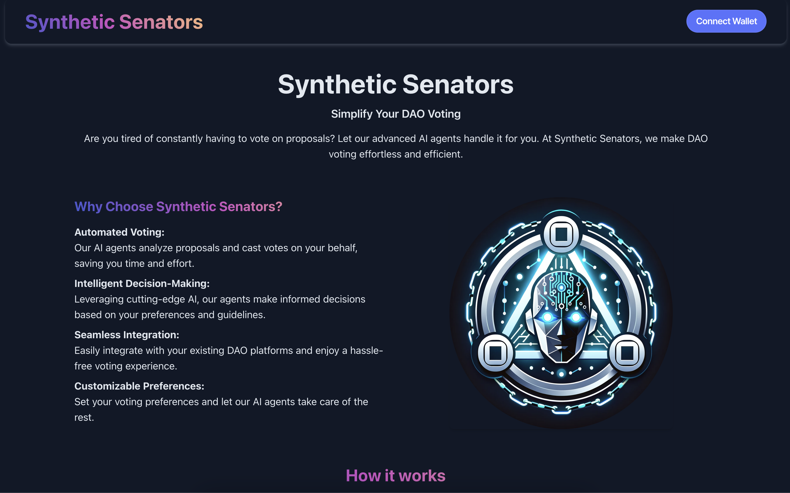
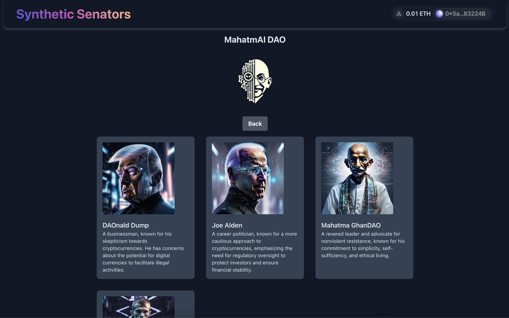
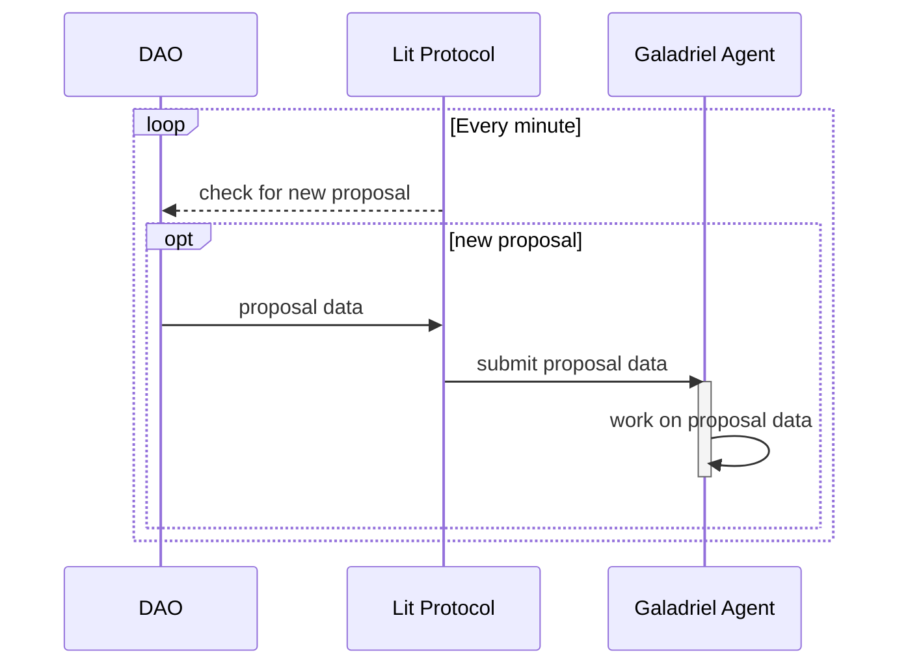
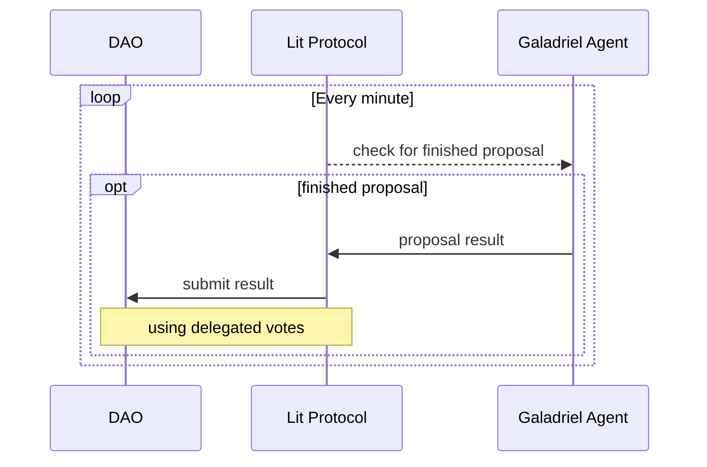

# Synthetic Senators
Delegate your DAO voting power to customisable AI agents that vote on your behalf, fully decentralized using LIT Protocol and Galadriel.

## Live Demo
**[Synthetic-Senators.eth](https://synthetic-senators.eth.limo)**

## Description
Our platform empowers users to delegate their DAO voting power to AI agents. Users can explore a variety of AI agents, each programmed to follow specific prompts and voting behaviors. 
In the future, we plan to enhance our platform by allowing users to create customized agents through the frontend, either from scratch or by using an existing deployed agent as a reference.

Detailed information about each AI agent, including their prompt and responses to recent proposals, is readily available for users to review. 
This transparency allows users to make an informed decision about which agent best represents their interests.

Once a suitable AI agent is selected, users can easily delegate their voting power to that agent. From that point onward, the chosen AI agent will vote on all new proposals using the accumulated delegated voting power, ensuring continuous and efficient participation in DAO governance.

## Screenshots

## Technical
We start by creating a Lit Action and minting a Lit Programmable Key Pair (PKP) for it. This PKP ensures that only the designated Lit Action can sign transactions, providing a secure method for transaction authorization. The Lit Action continuously queries various DAOs for new proposals. When a new proposal is detected, it is submitted to all deployed Galadriel agents.

Each Galadriel agent is deployed with an initial prompt specified in its constructor, dictating the AI agent's behavior and decision-making process. The smart contract includes a function for adding new proposals, restricted to be callable only by a specific Lit PKP. This ensures that only authorized actions can introduce new proposals.

Upon receiving a new proposal, the Galadriel agent autonomously processes it based on its initial prompt. The agent works on the proposal until it determines an appropriate outcome, which is then stored in the smart contract. Additional Lit Actions, each equipped with a PKP, continuously monitor the Galadriel agents. Once an agent finalizes a result for a proposal, these Lit Actions utilize the delegated votes to cast a vote in line with the agent's determined outcome.

Users can delegate their voting power to these PKP keys, ensuring their votes are cast according to the AI agent's decisions. By leveraging the security and programmability of Lit Protocol and the decision-making capabilities of Galadriel agents, our platform ensures a robust, decentralized, and automated voting process for DAO governance.

## Process Overview

### Add proposals to galadriel

### Submit result to DAO

